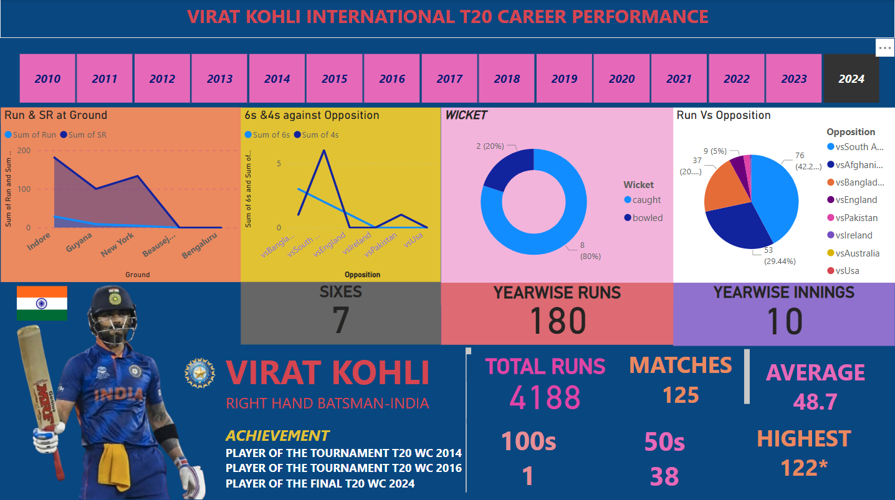

# 🏏 Virat Kohli T20 Career Performance Dashboard (Power BI)

This Power BI dashboard visualizes the complete T20 International career of legendary cricketer **Virat Kohli**. It provides a detailed look into his batting performance over the years, achievements, and match stats across different opponents and venues.

## 📊 Key Insights

- 📅 **Year-wise runs and innings** from 2010 to 2024
- 🆚 **Runs vs different international teams**
- 🏟️ **Performance at various grounds**
- 💯 Total career stats including:
  - 4188 Runs
  - 125 Matches
  - 48.7 Batting Average
  - 1 Hundred, 38 Fifties
  - Highest Score: 122*
- 📌 Analysis of 6s & 4s against opponents
- 🧠 Wicket type breakdown (caught vs bowled)

## 🏆 Achievements Highlighted

- Player of the Tournament – **T20 WC 2014 & 2016**
- Player of the Final – **T20 WC 2024**

## 🛠 Tools & Techniques

- Built with **Power BI Desktop**
- DAX used for calculated stats
- Custom visuals and layout for storytelling

## 📁 Project Structure
VIRAT_KOHLI_T20_PBI/
│
├── VIRAT_KOHLI_PBI.pbix       # Power BI dashboard file
├── VIRAT_KOHLI_PBI.png        # Dashboard preview image
└── README.md                  # This documentation
